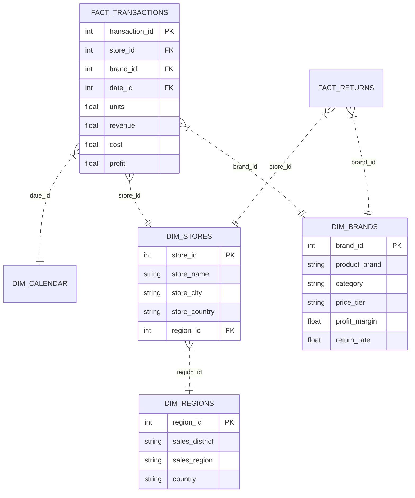

<div align="center">

  # 🛒 Walmart Market End-to-End Data Analytics Platform
  ### Cross-Border Retail Business Intelligence (USA • Mexico • Canada)

  <!-- Dynamic Typing Animation Banner -->
<<<<<<< HEAD
  <a href="https://github.com/">
    
  </a>
=======
  
>>>>>>> 7053a9c (Initial Commit)

  <br/><br/>

  <!-- Status & Quick Links Badges -->
  [](https://share.streamlit.io/)
  [](https://YOUR_GITHUB_USERNAME.github.io/walmart-data-analytics/)
  [](https://github.com/)
  [](LICENSE)

  <br/>

  <!-- Tech Stack Badges -->
  [](https://www.python.org/)
  [](https://www.sqlite.org/)
  [](https://powerbi.microsoft.com/)
  [](https://www.microsoft.com/excel)
  [](https://public.tableau.com/)
  [](https://streamlit.io/)
  [](https://tailwindcss.com/)

</div>

---

## 📌 Table of Contents
- [🎯 Executive Overview & KPIs](#-executive-overview--kpis)
- [🏗️ End-to-End Pipeline Architecture](#️-end-to-end-pipeline-architecture)
- [🗄️ Relational Data Model (Star Schema)](#️-relational-data-model-star-schema)
- [🛠️ Tool-by-Tool Technical Deep Dive](#️-tool-by-tool-technical-deep-dive)
  - [1. Python Data Science & OLS Regression](#1-python-data-science--ols-regression)
  - [2. SQL Analytics Studio (Window Functions & CTEs)](#2-sql-analytics-studio-window-functions--ctes)
  - [3. Power BI Desktop & DAX Architecture](#3-power-bi-desktop--dax-architecture)
  - [4. Excel Executive Financial Model](#4-excel-executive-financial-model)
  - [5. Tableau LOD Calculations & Architecture](#5-tableau-lod-calculations--architecture)
  - [6. Dual Live Web Deployments](#6-dual-live-web-deployments)
- [💡 Strategic Business Takeaways](#-strategic-business-takeaways)
- [🚀 Quickstart & How to Run](#-quickstart--how-to-run)
- [📂 Repository Structure](#-repository-structure)
- [👤 Author & Acknowledgments](#-author--acknowledgments)

---

## 🎯 Executive Overview & KPIs

This platform provides an enterprise data analytics and business intelligence solution analyzing Walmart's cross-border retail performance across **Canada, Mexico, and the United States (1998)**. 

The dataset captures **113,668 transactions**, **$449,627 in net revenue**, and **25 product brands** across 13 major commercial hubs.

### 📊 Topline Executive Scorecard (FY 1998)

| Key Metric | Actual Performance | Target Benchmark | Variance (%) | Strategic Status |
| :--- | :---: | :---: | :---: | :---: |
| **Current Month Transactions** | **18,325** | 17,339 | `+5.69%` | 🟢 Target Exceeded |
| **Current Month Net Profit** | **$71,682** | $67,872 | `+5.61%` | 🟢 Profit Expansion |
| **Current Month Returns** | **496** | 482 | `-2.90%` | 🟢 Favorable (Low Returns) |
| **Total Net Revenue** | **$449,627** | $430,000 | `+4.56%` | 🟢 High Revenue Acceleration |
| **Average Gross Profit Margin** | **59.94%** | 58.00% | `+194 bps` | 📈 Premium Margin Retention |
| **Portfolio Return Rate** | **1.00%** | < 1.10% | `-10 bps` | 🛡️ Healthy Portfolio Risk |

---

## 🏗️ End-to-End Pipeline Architecture

```mermaid
flowchart TD
    subgraph S1["1. Data Sourcing & Ingestion"]
        A["Relational Flat CSVs<br/>(Transactions, Brands, Stores, Regions)"]
    end
<<<<<<< HEAD
=======

    subgraph S2["2. Relational Modeling & Analytics"]
        B["SQLite Database Engine<br/>(walmart_analytics.db)"]
        C["Advanced SQL Window Functions & CTEs<br/>(LAG, LEAD, DENSE_RANK, CASE Anomaly Flags)"]
    end

    subgraph S3["3. Statistical Machine Learning & EDA"]
        D["Python SciPy & Statsmodels Suite<br/>(OLS Regression: R² = 0.7302, p < 0.001)"]
    end

    subgraph S4["4. Business Intelligence & Financial Modeling"]
        E["Power BI Desktop (Star Schema & DAX)"]
        F["Excel Financial Model (Dynamic BANs & Formulas)"]
        G["Tableau Architecture (LOD Expressions)"]
    end

    subgraph S5["5. Production Interactive Deployments"]
        H["Streamlit Cloud App (Interactive Python/Plotly)"]
        I["GitHub Pages Web Hub (Tailwind 2-Color UI)"]
    end

    A --> B
    B --> C
    B --> D
    C --> E
    C --> F
    C --> G
    D --> H
    B --> H
    E --> I
    F --> I
```
>>>>>>> 7053a9c (Initial Commit)

    subgraph S2["2. Relational Modeling & Analytics"]
        B["SQLite Database Engine<br/>(walmart_analytics.db)"]
        C["Advanced SQL Window Functions & CTEs<br/>(LAG, LEAD, DENSE_RANK, CASE Anomaly Flags)"]
    end

<<<<<<< HEAD
    subgraph S3["3. Statistical Machine Learning & EDA"]
        D["Python SciPy & Statsmodels Suite<br/>(OLS Regression: R² = 0.7302, p < 0.001)"]
    end
=======
## 🗄️ Relational Data Model (Star Schema)

The database (`walmart_analytics.db`) is organized into a clean **Star Schema** ensuring query speed, zero record duplication, and seamless BI tool connections:


>>>>>>> 7053a9c (Initial Commit)

    subgraph S4["4. Business Intelligence & Financial Modeling"]
        E["Power BI Desktop (Star Schema & DAX)"]
        F["Excel Financial Model (Dynamic BANs & Formulas)"]
        G["Tableau Architecture (LOD Expressions)"]
    end

<<<<<<< HEAD
    subgraph S5["5. Production Interactive Deployments"]
        H["Streamlit Cloud App (Interactive Python/Plotly)"]
        I["GitHub Pages Web Hub (Tailwind 2-Color UI)"]
    end

    A --> B
    B --> C
    B --> D
    C --> E
    C --> F
    C --> G
    D --> H
    B --> H
    E --> I
    F --> I
=======
## 🛠️ Tool-by-Tool Technical Deep Dive

### 1. Python Data Science & OLS Regression
- **Implementation**: [`python/walmart_eda_analysis.py`](python/walmart_eda_analysis.py) & [`walmart_data_analytics.ipynb`](walmart_data_analytics.ipynb)
- **Statistical Model**:
  $$\text{Revenue} = 374.53 \cdot \text{Week} + 20,247.96$$
- **Regression Diagnostics**:
  - **Goodness of Fit ($R^2$)**: `0.7302` (73.0% of weekly revenue variance explained by linear progression)
  - **P-Value Significance**: `7.81e-16` ($p < 0.001$, confirming statistically significant sales momentum toward December's \$40K+/week peaks)
  - **Standard Error of Estimate**: `±$32.20`

```python
# OLS Regression via SciPy
from scipy import stats
import pandas as pd

df = pd.read_csv('data/weekly_revenue.csv')
slope, intercept, r_val, p_val, std_err = stats.linregress(df['week_number'], df['revenue'])
r_squared = r_val ** 2

print(f"Weekly Growth Velocity: +${slope:.2f}/wk | R² = {r_squared:.4f} | P = {p_val:.2e}")
```

---

### 2. SQL Analytics Studio (Window Functions & CTEs)
- **DDL Schema**: [`sql/walmart_schema.sql`](sql/walmart_schema.sql)
- **Analytical Queries**: [`sql/walmart_queries.sql`](sql/walmart_queries.sql)
- **Interactive Runner**: [`sql/run_queries.py`](sql/run_queries.py)

<details>
<summary><b>🔍 Click to expand Core SQL Queries (CTEs & Window Functions)</b></summary>

```sql
-- Query 1: Top 10 Product Brands Pareto Distribution
WITH BrandRankings AS (
    SELECT 
        brand_id, product_brand, category, price_tier,
        transactions, revenue, profit,
        ROUND(profit_margin * 100, 2) AS profit_margin_pct,
        DENSE_RANK() OVER (ORDER BY transactions DESC) AS rank_by_volume,
        ROUND(revenue / (SELECT SUM(revenue) FROM brands) * 100, 2) AS pct_of_total_revenue
    FROM brands
)
SELECT rank_by_volume, product_brand, category, transactions, revenue, profit, profit_margin_pct, pct_of_total_revenue
FROM BrandRankings
WHERE rank_by_volume <= 10;

-- Query 2: Month-over-Month (MoM) Window Calculations via LAG()
WITH MonthlyAggs AS (
    SELECT month, SUM(revenue) AS monthly_revenue, SUM(profit) AS monthly_profit
    FROM weekly_revenue GROUP BY month
)
SELECT 
    month, monthly_revenue, monthly_profit,
    ROUND(((monthly_revenue - LAG(monthly_revenue, 1) OVER (ORDER BY month)) / 
           LAG(monthly_revenue, 1) OVER (ORDER BY month)) * 100, 2) || '%' AS rev_mom_growth
FROM MonthlyAggs;

-- Query 3: Return Rate Anomaly Detection with Conditional CASE Flags
SELECT 
    product_brand, category, transactions, returns_count,
    ROUND(return_rate * 100, 2) || '%' AS return_rate_pct,
    CASE 
        WHEN return_rate >= 0.0110 THEN '🚨 HIGH RISK ANOMALY (Action Required)'
        WHEN return_rate >= 0.0100 THEN '⚠️ Moderate Risk'
        ELSE '✅ Healthy (<1.00%)'
    END AS quality_flag
FROM brands
ORDER BY return_rate DESC;
```
</details>

---

### 3. Power BI Desktop & DAX Architecture
- **PBIX Report**: [`Wallmart Market Report(Power BI).pbix`](Wallmart%20Market%20Report(Power%20BI).pbix)
- **DAX Catalog**: [`powerbi/dax_measures.dax`](powerbi/dax_measures.dax)

<details>
<summary><b>📊 Click to expand DAX Measures Catalog</b></summary>

```dax
Total Revenue = 
SUMX(
    'Transaction_Data',
    'Transaction_Data'[Quantity] * 'Transaction_Data'[Unit Price]
)

Total Profit = 
[Total Revenue] - [Total Cost]

Profit Margin = 
DIVIDE([Total Profit], [Total Revenue], 0)

Return Rate = 
DIVIDE([Total Returns], [Total Transactions], 0)

MoM Growth % = 
VAR CurrentTxns = [Current Month Txns]
VAR PriorTxns = [Last Month Txns]
RETURN
DIVIDE(CurrentTxns - PriorTxns, PriorTxns, 0)
```
</details>

---

### 4. Excel Executive Financial Model
- **Workbook**: [`excel/walmart_executive_model.xlsx`](excel/walmart_executive_model.xlsx)
- **Features**:
  - **Sheet 1 (Executive Summary)**: High-impact BAN cards with variance benchmarking.
  - **Sheet 2 (Brand Performance)**: 25-brand matrix with dynamic `=G2/F2` margin formulas and `=J2/E2` return alerts.
  - **Sheet 3 (Weekly Financials)**: 52-week time-series model with cumulative running totals `=SUM($D$2:D2)`.

---

### 5. Tableau LOD Calculations & Architecture
- **Guide**: [`tableau/tableau_workbook_guide.md`](tableau/tableau_workbook_guide.md)
- **Calculated Fields & Level of Detail (LOD)**:
  - **Country Fixed LOD**: `{ FIXED [Store Country] : SUM([Revenue]) }`
  - **Profit Margin %**: `SUM([Profit]) / SUM([Revenue])`
  - **MoM Delta Table Calc**: `(ZN(SUM([Revenue])) - LOOKUP(ZN(SUM([Revenue])), -1)) / ABS(LOOKUP(ZN(SUM([Revenue])), -1))`

---

### 6. Dual Live Web Deployments
1. **GitHub Pages Web Portfolio**:
   - Single-page application built in [`index.html`](index.html).
   - Styled with a **2-solid-color theme** (`#0071CE` Walmart Blue & `#041E42` Deep Navy) with **zero gradients**.
   - Embeds Leaflet mapping, Chart.js visuals, responsive KPI filters, and file downloads.
2. **Streamlit Cloud Web App**:
   - Driven by [`app.py`](app.py) with Plotly interactive charts and real-time SQLite query execution.

---

## 💡 Strategic Business Takeaways

1. **Replicate Portland Holiday Milestone**: Portland Store #104 crossed 1,050 transactions in December (reaching the 1,000+ benchmark). Its end-cap merchandising strategy should be deployed across Pacific Northwest stores.
2. **Supplier Quality Audits**: Brands **Horatio (1.25%)** and **Nationeel (1.18%)** exceeded the 1.10% anomaly threshold. Implement return-allowance credits in supplier contracts.
3. **Mexico Expansion Corridor**: Mexico generated 40.6% of transaction volume with rapid metropolitan growth (Mexico City, Guadalajara, Monterrey), warranting regional distribution center expansion.
4. **Pareto Shelf Protection**: Top 5 brands (Hermanos, Ebony, Tell Tale, Tri-State, High Top) maintain >58% gross margins; secure long-term volume rebate agreements.

---

## 🚀 Quickstart & How to Run

### 🌐 Option A: Run Web Dashboard Locally
```powershell
cd "d:\Walmart Dashboard Project\walmart-data-analytics"
python server.py
# Opens automatically at http://localhost:8000
```
*(Or double-click `run_local.bat` in Windows File Explorer).*

---

### 🐍 Option B: Run Streamlit Cloud App Locally
```powershell
pip install -r requirements.txt
streamlit run app.py
# Launches at http://localhost:8501
```

---

### 🗄️ Option C: Run SQL Queries & Python Regression
```powershell
# Run SQL Analytics Studio against SQLite
python sql/run_queries.py

# Run Python OLS Regression
python python/walmart_eda_analysis.py
```

---

## 📂 Repository Structure

```text
walmart-data-analytics/
├── app.py                            # Streamlit Cloud web application
├── index.html                        # GitHub Pages unified dashboard (2-color theme)
├── requirements.txt                  # Python dependencies for Streamlit Cloud
├── server.py                         # Local Python HTTP server
├── run_local.bat                     # 1-click Windows launcher
├── package.json                      # Project metadata & scripts
├── README.md                         # Enterprise documentation
├── walmart_analytics.db              # SQLite relational star schema database
├── walmart_data_analytics.ipynb      # Jupyter Notebook (EDA & OLS Modeling)
├── Wallmart Market Report(Power BI).pbix  # Power BI Desktop report
├── wallamart power bi dashboard.pdf  # Power BI exported report documentation
├── DEMO VIDEO Power BI.mp4           # Video walkthrough
├── data/                             # Relational datasets
│   ├── brand_summary.csv             # 25-brand sales, margins & return rates
│   ├── regions.csv                   # Geographic dimension
│   ├── stores.csv                    # Store-level volume & milestone data
│   └── weekly_revenue.csv            # 52-week revenue time-series
├── excel/
│   └── walmart_executive_model.xlsx  # Multi-sheet financial workbook
├── powerbi/
│   └── dax_measures.dax              # Full catalog of DAX formulas
├── python/
│   ├── walmart_eda_analysis.py       # SciPy OLS regression script
│   └── outputs/                      # Saved regression plots
├── sql/
│   ├── run_queries.py                # SQLite Python query runner
│   ├── walmart_queries.sql           # Window functions & CTE queries
│   └── walmart_schema.sql            # DDL star schema script
└── tableau/
    └── tableau_workbook_guide.md     # LOD calculations & sheet blueprints
```

---

## 👤 Author & Acknowledgments

<div align="center">
  <h3>Sadiq Khan</h3>
  <p><strong>Data Analyst / Business Intelligence Engineer</strong></p>
  <p>Specializing in Python • SQL • Power BI • Excel Financial Modeling • Tableau • Streamlit</p>
  
  [](https://github.com/)
  [](https://linkedin.com/)
</div>
>>>>>>> 7053a9c (Initial Commit)
